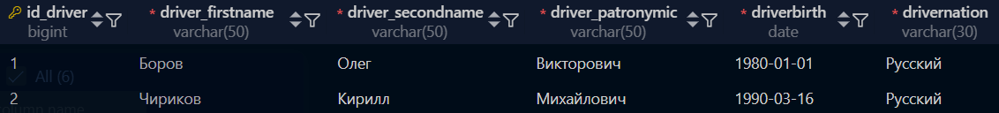
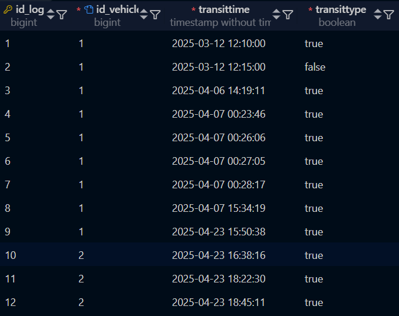
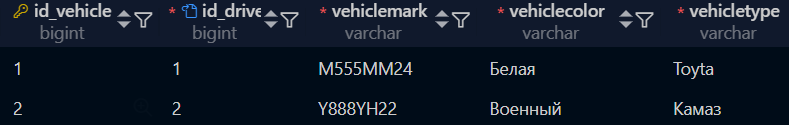
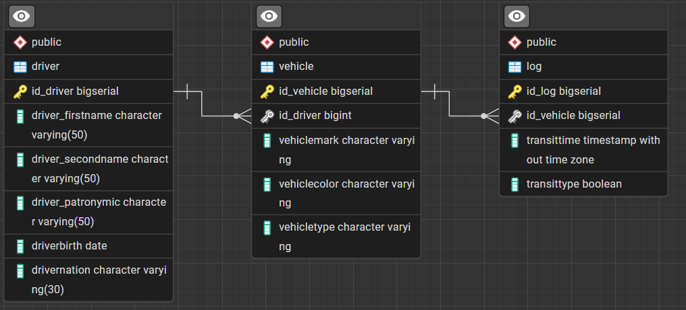
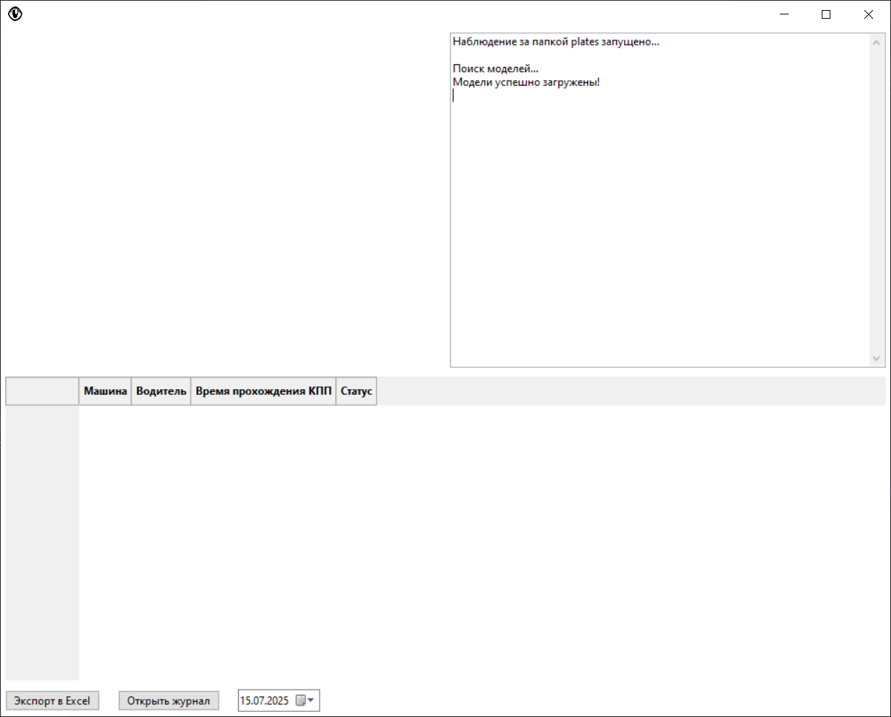

# Распознавание автомобильных номеров

[](https://github.com/Holodilni4ek/license_plate_recognition/blob/master/README.md)

**Приложение предназначено для автоматического распознавания автомобильных номеров с изображений и проверки, разрешен ли въезд автомобиля на основе списка зарегистрированных номеров.**

---

## Требования

Для работы приложения необходимо установить следующие компоненты:

- **Python 3.8 или выше**
- **PostgreSQL**
- **Установленные библиотеки:**
  - wxPython
  - tensorflow
  - opencv-python
  - scikit-image
  - matplotlib
  - requests
  - gdown
  - watchdog
  - numpy

---

## Установка

1. Клонируйте репозиторий проекта:

   ```bash
   git clone https://github.com/RecognitionVLT.git
   cd RecognitionVLT

2. Установите необходимые библиотеки:

    ```bash
    pip install wxPython tensorflow opencv-python scikit-image matplotlib requests gdown watchdog numpy

3. Установить PostgreSQL вы можете с их официального [сайта](https://www.postgresql.org/).

4. Импортируйте БД на свой сервер.

    - Таблица **driver** \
    

    - Таблица **log** \
    

    - Таблица **vehicle** \
    

5. Структура БД.

    

---

## Запуск

1. Перейдите в папку приложения:

    ```bash
    cd <Путь-к-приложению>

2. Запустите проект:

    ```bash
    python main.py

3. После запуска откроется графическое окно приложения.

    

4. **Распознавание:** \
    Приложение автоматически начнет распознавание, как только в папку **plates** будет добавлено новое изображение.\
    Результаты распознавания будут отображаться в текстовом поле приложения:\
    Если номер найден в базе данных, появится сообщение: *Вход разрешен*.\
    Если номер не найден, появится сообщение: *Вход запрещен*.\
    Изображение с выделенным номером будет отображаться в интерфейсе приложения.

---

## Лицензия

Этот проект распространяется под лицензией MIT. Подробнее см. в файле LICENSE.

---

## Поддержка

Если у вас возникли вопросы или проблемы, создайте issue в репозитории проекта или свяжитесь с автором:
    Email: <cadetstepan13@gmail.com>
    GitHub: <https://github.com/Holodilni4ek>
