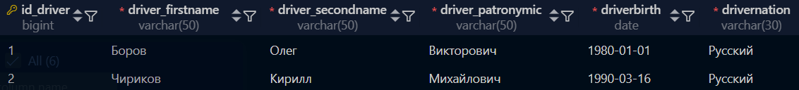
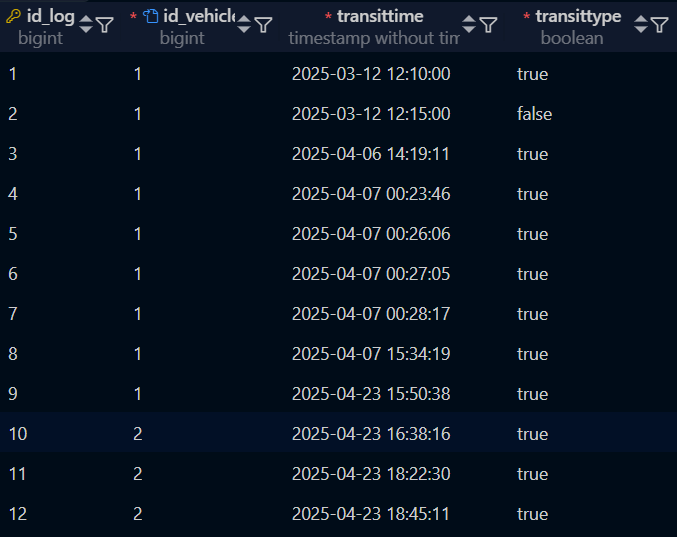
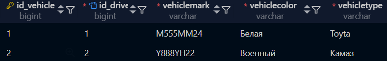
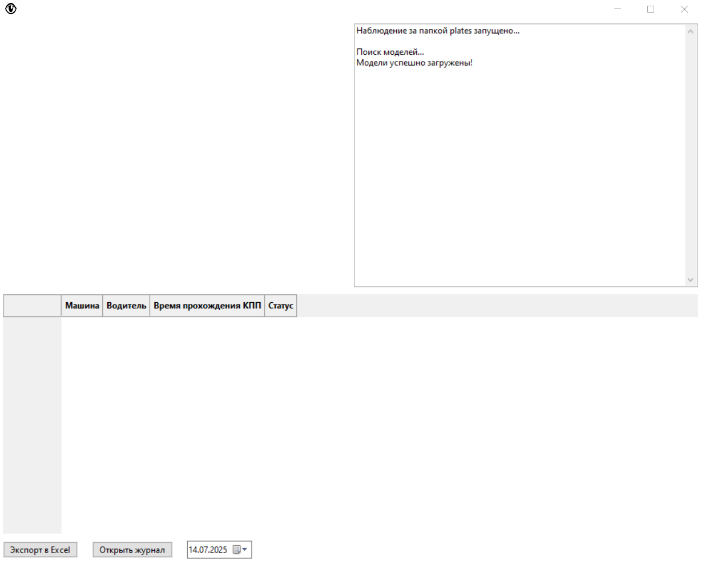

# Number Plate Recognition

[](https://github.com/Holodilni4ek/license_plate_recognition/blob/master/README.md)

**The application is designed for the automatic recognition of number plates from images and checking whether a vehicle is permitted to enter based on a list of registered numbers.**

---

## Requirements

To run the application, the following components must be installed:

- **Python 3.8 or higher**
- **PostgreSQL**
- **Installed libraries:**
  - wxPython
  - tensorflow
  - opencv-python
  - scikit-image
  - matplotlib
  - requests
  - gdown
  - watchdog
  - numpy

---

## Installation

1. Clone the project repository:

   ```bash
   git clone https://github.com/RecognitionVLT.git
   cd RecognitionVLT
   ```

2. Install the necessary libraries:

    ```bash
    pip install wxPython tensorflow opencv-python scikit-image matplotlib requests gdown watchdog numpy
    ```

3. You can install PostgreSQL from their official [website](https://www.postgresql.org/).

4. Import the database to your server.

    - Table **driver**
    

    - Table **log**
    

    - Table **vehicle**
    

5. Database structure

    

---

## Running

1. Navigate to the application folder:

    ```bash
    cd <Path-to-application>
    ```

2. Run the project:

    ```bash
    python main.py
    ```

3. After launching, a graphical window of the application will open.

    

4. Recognition:
    The application will automatically start recognition as soon as a new image is added to the **plates** folder.\
    The recognition results will be displayed in the text field of the application:\
    If the number is found in the database, a message will appear: *Entry permitted*.\
    If the number is not found, a message will appear: *Entry denied*.\
    The image with the highlighted number will be displayed in the application interface.

---

## License

This project is licensed under the MIT License. For more details, see the LICENSE file.

---

## Support

If you have any questions or issues, please create an issue in the project repository or contact the author:
    Email: <cadetstepan13@gmail.com>
    GitHub: <https://github.com/Holodilni4ek>
